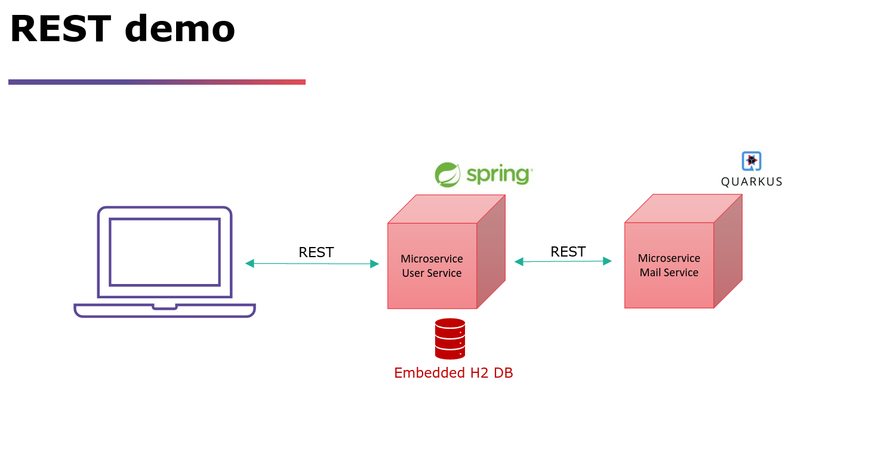

# spring-boot-microservice-demo
Demo project to Spring Boot microservice architecture in the cloud. This demo has the purpose to demonstrate REST communcation for academic use. Feel free to reuse it as long if you reference the author.
#

### Demo structure

### What are we doing here:
- We have two microservices. 
    - One User Service managing the user domain
    - One Mail Service managing the notifaction domain
- We can retrieve, insert, update & delete users via REST
- Modifying call triggers a synchronous mail notification by the mail service
#

### What you need
- IDE of your choise (IntelliJ or Eclipse)
- A browser
- Postman
#

### Notes
- To access the H2 in-memory DB open http://localhost:8882/h2 in your browser - application must run. (username: user, password: user)
- Import the Postman collection into your Postman to use prepared REST commands